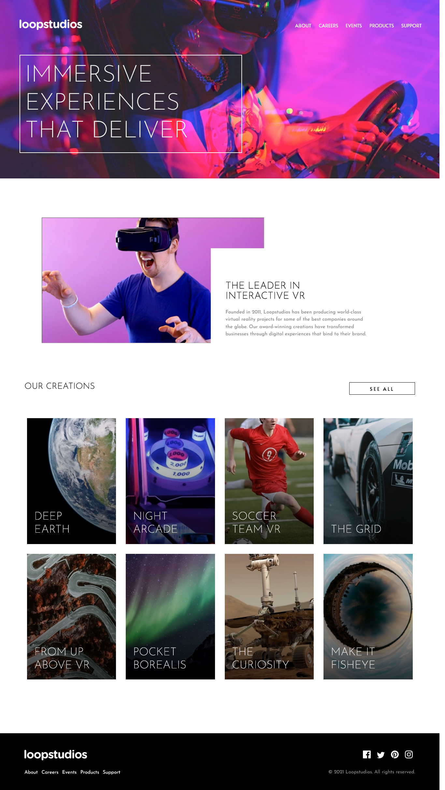

# Frontend Mentor - Loopstudios landing page solution

This is a solution to the [Loopstudios landing page challenge on Frontend Mentor](https://www.frontendmentor.io/challenges/loopstudios-landing-page-N88J5Onjw). Frontend Mentor challenges help you improve your coding skills by building realistic projects. 

## Table of contents

- [Overview](#overview)
  - [The challenge](#the-challenge)
  - [Screenshot](#screenshot)
  - [Links](#links)
- [My process](#my-process)
  - [Built with](#built-with)
  - [What I learned](#what-i-learned)
  - [Challenges](#challenges)
  - [Continued development](#continued-development)
  - [Useful resources](#useful-resources)
- [Author](#author)
- [Acknowledgments](#acknowledgments)

**Note: Delete this note and update the table of contents based on what sections you keep.**

## Overview

### The challenge

Users should be able to:

- View the optimal layout for the site depending on their device's screen size
- See hover states for all interactive elements on the page

### Screenshot

### Links

- Live Site URL: https://dstrickl7.github.io/Loop-Studios-Landing-Page/

## My process

### Built with

- Semantic HTML5 markup
- Flexbox
- CSS Grid
- Mobile-first
- SCSS

### What I learned

This is my first project where I coded a mobile first page. I usually start with desktop and add media queries to fit smaller screens. I found starting with mobile challenging at first because I wasn't sure how the layouts would work on larger screens. The benefits I found were that I was able to view both mobile and desktop layouts without one (usually my mobile) being completely broken. This made it easier for me to make adjustments as I worked.

I ended up repeating myself A LOT and I found this made working with my stylesheet both frustrating and annoying as it got larger. This caused me to look into ways to better structure my stylesheets. This issue came into play as I started attempting XLG screen layouts. This is where I found SASS shined. Using mixins and modules really helped organize my stylesheet.

### Challenges
SASS - Struggled with using modules until I discovered I was running Ruby Sass instead of Dart Sass.
Button placement - I forgot that you need to set the parent element's position to relative in order to use position absolute on the child element. Until I saw it used elsewhere, I was stuck on the button positioning.
Responsive Layout - Getting the placement to match the design in every browser size was a huge challenge. I wasn't able to perfect this.

### Continued development

I would like to work more with SCSS and refine my knowledge. Responsive and accessible images. I found the simplest way to use the optimized images was to use the css background feature with media queries. I would like to find whether there's another way that allows me to add alt with the image.

### Useful resources

- [MDN Web Docs](https://developer.mozilla.org/en-US/) - My go-to resource for syntax and use examples

## Author
Danielle S.
- Frontend Mentor - [@dstrickl7](https://www.frontendmentor.io/profile/dstrickl7)
- Codepen - [@dstrickl7](https://codepen.io/dstrickl7)
- Github - [dstrickl7](https://github.com/dstrickl7)

## Acknowledgments

-Justin (https://codepen.io/jstn) for his Animated Underline Hover

